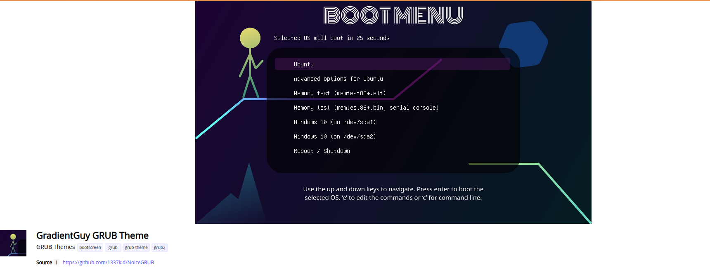

# LInuxAll





### Basic 
```
sudo apt update
sudo apt upgrade -y
sudo apt install nano
sudo apt install snapd -y
sudo apt install libreoffice -y
1. vscode 
2. compilers
```

### Custom
##### 1. Grub
````
sudo nano /etc/default/grub

GRUB_THEME=/home/pranav/Downloads/CyberEXS-1.0.0/CyberEXS/theme.txt
sudo reboot
````
##### 2. terminal tux and all
```
sudo apt install cowthink
sudo apt install lolcat
sudo nano ~/.bashrc
cowthink -f tux OSCAR | lolcat
```
##### 3. sudo/root permissions to user
```
cat /etc/passwd
cat /etc/group
sudo usermod -aG sudo $USER
```
##### 4. git configuration
```
sudo apt install -y git
git config --global user.name ""
git config --global user.email ""
```

##### 5. github configure
```
github account activation
token generate
```

##### 6. python
```
sudo apt install -y python3 python3-pip python3-venv
```

##### 7. gnome
```
sudo apt install gnome-tweaks gnome-shell-extensions
```

### vscode chrome whatsapp docker kubctl 


### ifNeeded
```
in .bashrc
export DOCKER_HOST="unix:///var/run/docker.sock"
```

### Final
```
sudo reboot
```